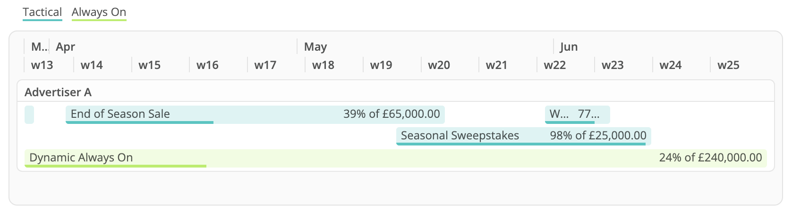

# mci-d3-timeline
Custom widget for Datorama. Interactive timeline with date aggregation, labels, groups, colour coding, tooltips, and progress bars.

This widget will aggregate the input data to the level of the selected 'main dimension'. That means
* it will take the minimum start date and maximum end date, so you can make use of dates from granularities below your main dimension such as Media Buy Start/End or IO Start/End;
* your measurements will be summed, therefore it's not compatible with rate-type measurements, unless using dates from the same granularity of your main dimension; and
* dimension data will be lost if dimensions are added with greater detail than your main dimension.

After adding data to your widget, double-check the Design panel to make sure the selected dimension and measurement roles are correct.

## Style and Script Dependencies
Add `timeline.initialize();` to the JS section of the Custom Widget Editor, and add the below links to the dependencies area (second button at the top left of the Custom Widget Editor).

Script dependencies (must be loaded in this order):
1. `https://d3js.org/d3.v7.min.js`
2. `https://solutions.datorama-res.com/public_storage_solutions/timeline/v1/timeline.js`

Style depenency:
1. `https://solutions.datorama-res.com/public_storage_solutions/timeline/v1/timeline.css`

## Preferences
All configuration options are located in the widget's design panel.

These include options for
* timeline granularity;
* start of week;
* start of year;
* timeline bar colour;
* dimension roles (main dimension, start date, end date, optional grouping, optional colour coding);
* colour coding style;
* measurement roles (progress numerator/label, progress denominator); and
* mouseover tooltip inclusion.
